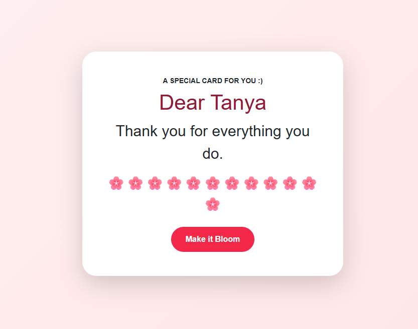

# Mothers day webapp

A webapp you can send to a mother via email or text to make your mother's day.

## Demo

[Live site](https://ben-ortiz.github.io/mothers-day-webapp/)

## Screenshots



## Features

- Clicking button shows more messages.
- Final message once enough times button clicked
- Flower emojis populate page the more you click the button.

## Tech Stack

- HTML
- CSS
- Vanilla JavaScript

## Getting Started

Clone the repo:

```
git clone https://github.com/Ben-Ortiz/mothers-day-webapp.git
```

Open in Visual Studio  
Edit the files
